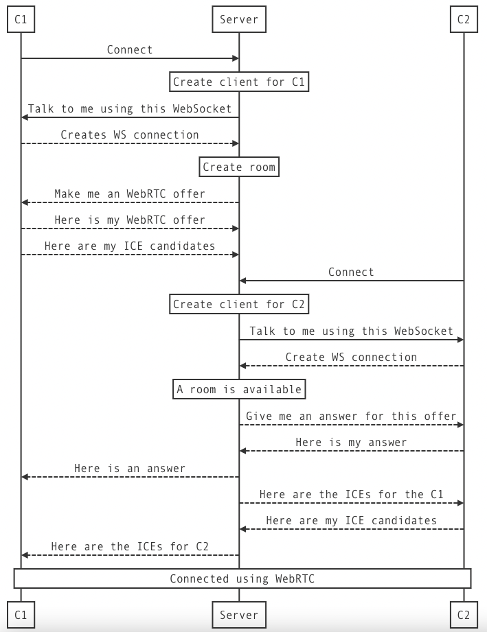

# WebRTC Signalling Server
Been experimenting with WebRTC and it's capabilities and made this signalling server as a result. It's written using
Express and uses WebSockets to signal to clients.

## Signalling flow
Signalling happens like shown below. Solid arrows are HTTP requests and dashed arrows are WebSocket messages.

